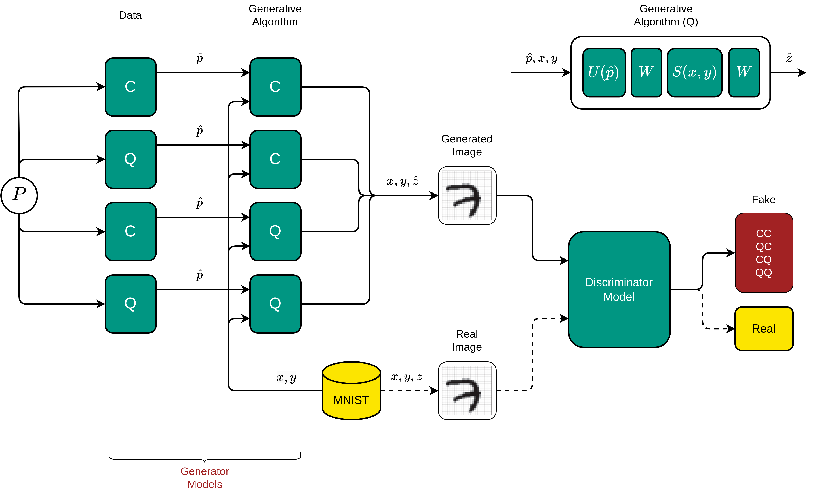

# HIDA-Deep-Fake

## Concept

## Usage

Requirements can be found in `requirements.in` and installed via `pip install -r requirements.in`.
After installation, a MlFlow server must be started prior to any training.
This can be done via `mlflow server` in a separate terminal.
Without further configuration, one can run `python src/__main__.py` which will run a classical/classical GAN model.
Configuaration and training of other models can be made via command line arguments of configuration files located in `config/`.
Regarding the configuration values, the order of importance is as follows:
1. Command line arguments
2. Config values of a file provided via `overwrite_config` (e.g. `cc_gan.yaml`)
3. Default values from `default.yaml`
If a required argument is neither found in any of the files nor provided via command line, an error will be raised.

Once the training has started, the all configuration parameters, the model and the training history are being recorded using MlFlow.
The url to navigate to the currently running experiment will be stated at the command line.

## Structure

- `config`:
  - `default.yaml`: All parameters that are required/ shared among the different models
  - `cc_gan.yaml`: Parameters for the classical/classical approach
  - `cq_gan.yaml`: Parameters for the classical/quantum approach
  - `qc_gan.yaml`: Parameters for the quantum/classical approach
  - `qq_gan.yaml`: Parameters for the quantum/quantum approach
- `src`: Actual source code for training etc.
  - `main.py`: Main entry point to start training of the GAN
  - `dataset.py`: Class to setup the dataset structure
  - `classical_generator.py`: Classical generator model
  - `quantum_generator.py`: Quantum generator model
  - `classical_noise_source.py`: Classical noise source model
  - `quantum_noise_source.py`: Quantum noise source model
- `doc`: Diagrams and documentation
- `notebooks`: Tests and random experiments

